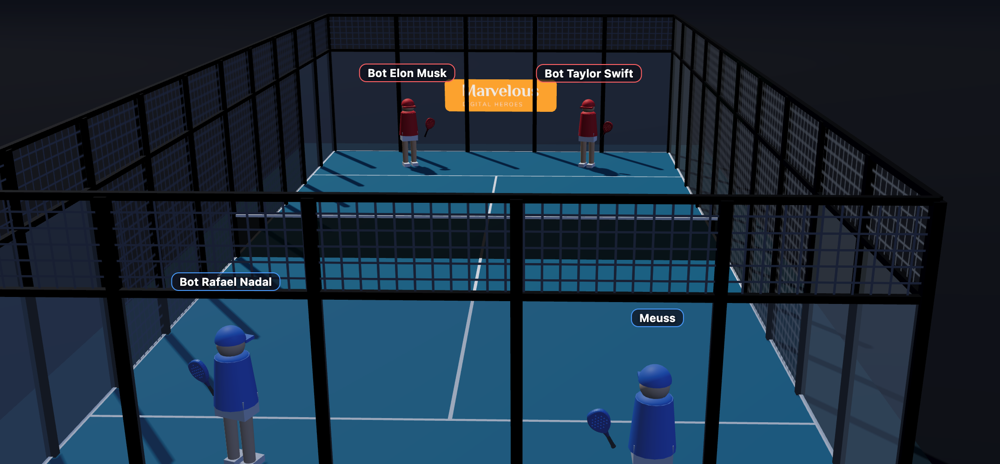
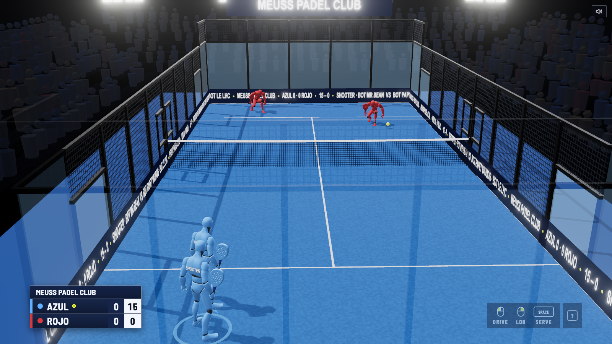
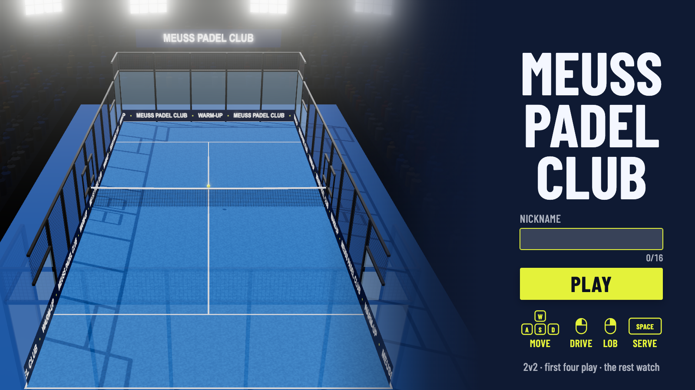
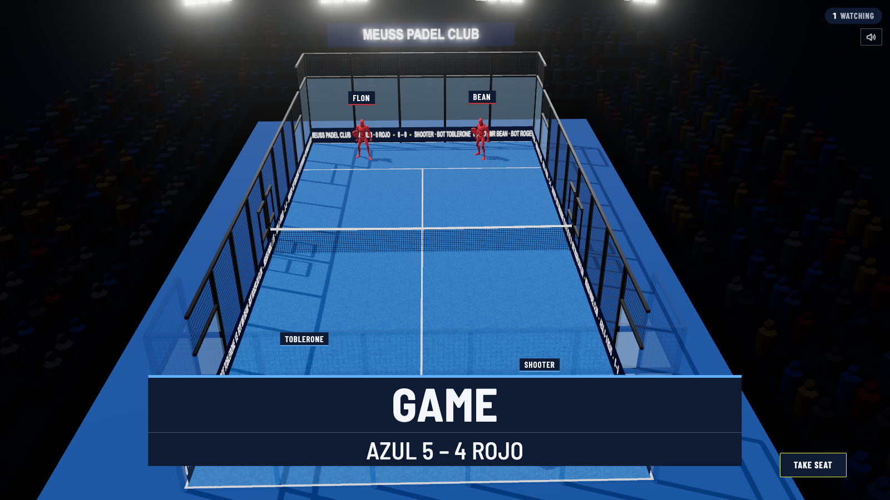

# Meuss Padel Club

A browser-based 2v2 online padel game: server-authoritative physics over
WebSockets, rendered with Three.js. The first four visitors play, everyone else
spectates.

**Play:** https://meuss.github.io/padel-2v2/

## V1 → V2

V2 is a full redesign built with **Claude Opus 5.5** (in Claude Code). It covers
the look, how hits feel, the netcode and the match flow.

| V1 | V2 |
|---|---|
|  |  |
| — |   |

What V2 has:

- A night broadcast arena: floodlights, a crowd in the stands, LED boards with the
  live score and names.
- The regulation cage: glass and metal mesh at regulation heights, each with its
  own bounce, and a sagging net.
- Mannequin players in Azul and Rojo kits.
- Drive, Lob and an automatic Smash, each with Timing (early, perfect, late).
- An aimed serve: toss, then strike at the top.
- Lag-compensated hits and client-side prediction.
- Synthesized sound.
- The score bug and the Score call.
- Banners between points.
- Instant replays of notable points.
- Fault animations that show what lost the point, where it happened.
- The Final card and a Rematch vote.
- Take seat for spectators.
- A controls card.

All screenshots are real renders from the game (`pnpm shoot`).

## Run locally

Requires Node 24 (see `.node-version`) and pnpm (the version is pinned in
`package.json` → `packageManager`; `corepack enable` picks it up).

```bash
pnpm install
pnpm dev          # client on http://localhost:5173, server on :8080
```

| Command | What it does |
|---|---|
| `pnpm dev` | Client + server with reload |
| `pnpm dev:client` / `pnpm dev:server` | One side only |
| `pnpm typecheck` | `tsc` in every package |
| `pnpm test` | Vitest, all packages |
| `pnpm build` | Production client build → `packages/client/dist` |

To test a full match alone, open the game and press `B` three times to add bots.
Bots serve by themselves; you serve with `Space` then a click.

## How to play

| Input | Action |
|---|---|
| `WASD` / arrows | Move (relative to your side of the court) |
| Mouse | Aim |
| Left-click | Drive |
| Right-click | Lob |
| (automatic) | Smash, when the ball is high at contact |
| `Space`, then click | Toss, then click at the top of the toss to serve |
| `Enter` | Skip a replay (for everyone) |
| `M` | Sound on / off |
| `E` | Reaction emote |
| `?` | Controls |
| `B` / `N` | Add a bot / clear all bots |
| Take seat | Spectators: replace a bot or fill an empty seat |

- Everyone, spectators included, is kicked after **60 s** without mouse or keyboard
  activity.
- Any human player can start a **reset vote** ("Reset the set", in the controls card
  that `?` opens) to restart the match. It
  needs every human player to accept; one decline cancels it, and it expires after
  30 s. When a match ends, the Final card opens a **Rematch vote**.
- Scoring follows modern padel: golden point at deuce, sets to 6 (win by 2),
  tiebreak at 6–6.

## Project layout

```
packages/
  shared/   wire protocol, court & tuning constants, the regulation cage (CAGE),
            pure gameplay, Shot, replay and nickname logic
  server/   Node + ws + Rapier: room loop, physics, match rules, bots, stats,
            GET /status
  client/   Vite + Three.js
    src/world/    arena, court & cage, players, cameras, hit feedback, fault animations
    src/hud/      score bug, Banner, Final card, votes, controls, join screen
    src/replay/   Instant replay: recorder, director, player
    src/audio/    synthesized sound (Web Audio)
scripts/shoot.mjs  headless screenshots + render stats (`pnpm shoot`, dev server running)
docs/              screenshots, design comps, V2 spec and plans
```

- Gameplay tuning (ball speed, swing power, court size, scoring rules) lives in
  `packages/shared/src/constants.ts`; the cage layout in `packages/shared/src/court.ts`.
- `@padel/shared` has no build step. Both sides import its TypeScript source
  directly.
- Rapier is pinned to exactly `0.18.0`: newer versions change how the ball
  bounces. See `CLAUDE.md` before upgrading it.

## Deploy

**Pushing to `master` deploys everything.** There is no staging environment.

| What | Where | Trigger |
|---|---|---|
| CI (typecheck, test, build) | GitHub Actions, `ci.yml` | Push to `master` and every pull request |
| Client | GitHub Pages, `deploy-pages.yml` | Push to `master`, or run it manually from the Actions tab |
| Server | Render free tier, `render.yaml` | Auto-deploys on push to the branch connected in Render (`master`) |

The Pages deploy does not wait for CI, so a broken `master` still ships.
Work on a branch and open a PR to get CI first.

### Configuration to remember

- **`VITE_SERVER_URL`**: GitHub repo **variable** (Settings → Secrets and
  variables → Actions → Variables), currently
  `wss://padel-2v2-server.onrender.com`. It is baked into the client at build
  time, so after changing it, re-run the Pages workflow. If it's missing, the
  client tries `ws://localhost:8080`.
- **`VITE_BASE`**: set automatically by the workflow to `/<repo-name>/`. Renaming
  the repo changes the Pages URL.
- **GitHub Pages source** must be set to "GitHub Actions" in the repo settings.
- **Render**: the service was created from `render.yaml` (New → Blueprint).
  Edits to that file apply on the next sync. The build runs
  `npx pnpm@<version>`, so **bump it there whenever `packageManager` changes**.
  Render provides `PORT`. Locally the server defaults to 8080.
- **Cold starts**: Render's free tier sleeps after ~15 min idle. The first visitor
  waits 30–60 s, and the client shows a "waking up" screen meanwhile. Health
  check: `GET /health`.
